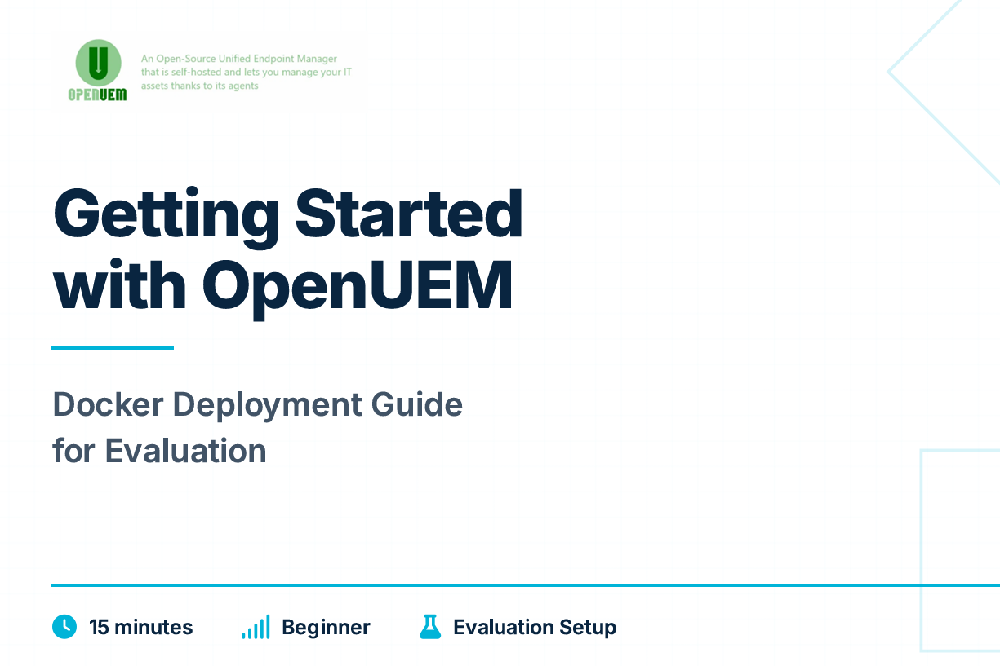

# Getting Started with OpenUEM

 
**Last Updated:** November 2, 2025  
**Estimated Time:** 15 minutes  
**Difficulty:** Beginner  
**Intended Audience:** IT Administrators, System Engineers, DevOps Engineers


## Overview

This guide provides step-by-step instructions for deploying a local evaluation instance of OpenUEM using Docker Compose. OpenUEM is an open-source unified endpoint management (UEM) platform that provides IT asset inventory, remote monitoring, and device management capabilities across Windows, Linux, and macOS endpoints.

Upon completion of this guide, you will have a fully functional OpenUEM server running on your local machine, accessible via HTTPS with certificate-based authentication. This deployment is suitable for evaluation, testing, and development purposes.

> **IMPORTANT**: This guide configures OpenUEM for local evaluation using `localhost` as the server name. For production deployments with remote agents, DNS configuration, and enhanced security, refer to the [complete Docker installation guide](https://openuem.eu/docs/Installation/Server/docker/).

## What You Will Accomplish

By following this guide, you will:

1. Deploy all OpenUEM server components using Docker Compose
2. Initialize a PostgreSQL database with the required schema
3. Generate self-signed certificates for secure HTTPS communication
4. Configure certificate-based authentication for the web console
5. Access the OpenUEM administrative console via your web browser

## Prerequisites

Before proceeding, ensure your system meets the following requirements:

### Required Software

| Component | Minimum Version | Purpose |
|-----------|----------------|---------|
| Docker | 20.10+ | Container runtime |
| Docker Compose | 2.0+ | Multi-container orchestration |
| Git | 2.0+ | Repository cloning |

### System Requirements

- **Operating System**: Linux, macOS, or Windows with WSL2
- **RAM**: 4 GB minimum, 8 GB recommended
- **Disk Space**: 2 GB for container images and data
- **Network**: Internet connection for downloading container images

### Verify Prerequisites

Confirm that Docker and Docker Compose are properly installed and accessible:

```bash
docker --version
docker compose version
git --version
```

Expected output should display version numbers for each command. If any command fails, install the missing component before proceeding.

## Architecture Overview

The Docker Compose deployment creates the following components:

- **PostgreSQL Database**: Stores device inventory, user data, and configuration
- **NATS Server**: Message broker for agent communication
- **Console**: Web-based administrative interface
- **OCSP Responder**: Certificate validation service
- **Certificate Manager**: Automated certificate lifecycle management
- **Agents Worker**: Processes agent check-ins and commands
- **Notification Worker**: Handles alerts and notifications

All components communicate over an internal Docker network and are configured automatically through environment variables.

## Step 1: Clone the Configuration Repository

Clone the OpenUEM Docker configuration repository to your local system. This repository contains the Docker Compose configuration, environment templates, and initialization scripts.

```bash
git clone https://github.com/open-uem/openuem-docker
cd openuem-docker
```

**Verification**: Confirm the repository was cloned successfully by listing the directory contents:

```bash
ls -la
```

You should see the following key files:

- `docker-compose.yml` - Container orchestration configuration
- `.env-example` - Environment variable template
- `README.md` - Repository documentation

## Step 2: Configure Environment Variables

Create the environment configuration file by copying the provided template:

```bash
cp .env-example .env
```

For this evaluation deployment, you only need to configure the `SERVER_NAME` variable. Open the `.env` file in your preferred text editor and set:

```bash
SERVER_NAME=localhost
```

All other variables will use their default values, which are suitable for local evaluation.

> **NOTE**: The default configuration uses pre-set database credentials and ports. These defaults are acceptable for local testing but **must be changed** for production deployments. Refer to the [full Docker installation guide](https://openuem.eu/docs/Installation/Server/docker/) for production configuration details.

### Understanding SERVER_NAME

The `SERVER_NAME` variable defines the hostname used in certificate generation and agent communication. Setting this to `localhost` restricts access to the local machine only. For production deployments where remote agents need to connect, this must be set to a fully qualified domain name (FQDN) that resolves via DNS.

## Step 3: Initialize the Database and Certificates

Execute the initialization profile to create the PostgreSQL database and generate the required SSL/TLS certificates:

```bash
docker compose --profile init up -d --build
```

This command performs the following operations:

1. Downloads the PostgreSQL container image (if not already cached)
2. Creates a dedicated Docker volume for database persistence
3. Initializes the OpenUEM database schema
4. Generates a Certificate Authority (CA) certificate
5. Creates server certificates for HTTPS communication
6. Generates an administrator user certificate for authentication

> **NOTE**: Initial execution typically requires 3-5 minutes as Docker downloads container images (~500 MB) and generates cryptographic certificates. Subsequent executions will be significantly faster as images are cached locally.

**Verification**: Monitor the initialization process. Once complete, you should see output similar to:

```
✔ Network openuem_default  Created
✔ Volume "openuem_pgdata"  Created
✔ Container openuem-db-1   Healthy
✔ Container openuem-certs  Started
```

Confirm that the `certificates` directory was created in your current working directory:

```bash
ls -la certificates/
```

You should see the following subdirectories:

- `ca/` - Certificate Authority files
- `console/` - Web console certificates
- `users/` - User authentication certificates
- `agents/` - Agent enrollment certificates

> **WARNING**: The certificate generation process must complete before proceeding. Verify that `certificates/ca/ca.cer` and `certificates/users/admin.pfx` exist before continuing to the next step.

## Step 4: Start OpenUEM Services

Launch all OpenUEM application components using the `openuem` profile:

```bash
docker compose --profile openuem up -d --build
```

This command starts the following services:

- NATS message broker
- OpenUEM web console
- OCSP responder for certificate validation
- Certificate manager worker
- Agents worker for device management
- Notification worker for alerts

**Verification**: Confirm that all containers started successfully:

```bash
docker compose ps
```

Expected output should show all services in the "running" state:

```
NAME                              STATUS
openuem-agents-worker-1           Up
openuem-cert-manager-worker-1     Up
openuem-console-1                 Up
openuem-db-1                      Up (healthy)
openuem-nats-server               Up
openuem-notification-worker-1     Up
openuem-ocsp-responder-1          Up
```

If any container shows a status other than "Up" or "Up (healthy)", check the logs:

```bash
docker compose logs [container-name]
```

## Step 5: Configure Browser Certificate Authentication

OpenUEM uses certificate-based authentication instead of traditional username/password credentials. This approach provides enhanced security through cryptographic identity verification and eliminates risks associated with weak or compromised passwords.

Before accessing the web console, you must import two certificates into your browser:

1. **CA Certificate** (`ca.cer`) - Allows your browser to trust OpenUEM's self-signed certificates
2. **User Certificate** (`admin.pfx`) - Provides your administrative identity for authentication

### Import the Certificate Authority (CA) Certificate

The CA certificate must be imported into your browser's trusted root certificate store.

**For Chrome and Edge on Windows:**

1. Open **Settings** → **Privacy and security** → **Security** → **Manage certificates**
2. Navigate to the **Trusted Root Certification Authorities** tab
3. Click **Import** and browse to `certificates/ca/ca.cer`
4. Follow the Certificate Import Wizard, accepting all defaults
5. Click **Finish** to complete the import

**For Firefox (all platforms):**

1. Open **Settings** → **Privacy & Security** → **Certificates** → **View Certificates**
2. Navigate to the **Authorities** tab
3. Click **Import** and select `certificates/ca/ca.cer`
4. Check **Trust this CA to identify websites**
5. Click **OK** to confirm

**For Safari on macOS:**

1. Double-click `certificates/ca/ca.cer` in Finder
2. In the dialog, select **System** from the Keychain dropdown
3. Click **Add** to import the certificate
4. Open **Keychain Access** application
5. Locate the imported certificate under **System** keychain
6. Double-click the certificate and expand **Trust**
7. Set **When using this certificate** to **Always Trust**
8. Close the window and authenticate with your system password

### Import the Administrator User Certificate

The user certificate provides your administrative identity and must be imported into your browser's personal certificate store.

**For Chrome and Edge on Windows:**

1. Open **Settings** → **Privacy and security** → **Security** → **Manage certificates**
2. Navigate to the **Personal** tab
3. Click **Import** and browse to `certificates/users/admin.pfx`
4. When prompted for a password, enter: `changeit`
5. Accept all defaults in the Certificate Import Wizard
6. Click **Finish** to complete the import

**For Firefox (all platforms):**

1. Open **Settings** → **Privacy & Security** → **Certificates** → **View Certificates**
2. Navigate to the **Your Certificates** tab
3. Click **Import** and select `certificates/users/admin.pfx`
4. When prompted for a password, enter: `changeit`
5. Click **OK** to confirm

**For Safari on macOS:**

1. Double-click `certificates/users/admin.pfx` in Finder
2. When prompted for a password, enter: `changeit`
3. Select **login** keychain (not System)
4. Click **OK** to import

> **IMPORTANT**: The default certificate password is `changeit`. This password is acceptable for evaluation purposes but **must be changed** for production deployments. Refer to the [full Docker installation guide](https://openuem.eu/docs/Installation/Server/docker/) for instructions on generating certificates with custom passwords.

### Why Certificate-Based Authentication?

OpenUEM implements certificate-based authentication to provide:

- **Enhanced Security**: Digital certificates are cryptographically signed and significantly harder to compromise than passwords
- **Strong Authentication**: Certificates provide cryptographic proof of identity, preventing credential stuffing and brute-force attacks
- **Passwordless Access**: Eliminates risks associated with weak passwords, password reuse, and phishing attacks
- **Audit Trail**: Certificate-based authentication provides non-repudiable proof of user identity for compliance and auditing

## Step 6: Access the OpenUEM Console

Open your web browser and navigate to:

**[https://localhost:1323](https://localhost:1323)**

> **NOTE**: You must use `https://` (not `http://`). The console is only accessible via encrypted HTTPS connections.

### First Login

When you access the console for the first time, your browser will prompt you to select a client certificate for authentication:

1. A certificate selection dialog will appear
2. Select the **admin** certificate you imported in Step 5
3. Click **OK** or **Allow** to proceed

Your browser will authenticate using the selected certificate, and you will be automatically logged into the OpenUEM administrative console.

### Expected Console Interface

After successful authentication, you should see the OpenUEM dashboard with the following sections:

- **Devices**: Inventory of managed endpoints (initially empty)
- **Users**: User and certificate management
- **Policies**: Configuration profiles and policies
- **Reports**: System reports and analytics
- **Settings**: System configuration options

> **TIP**: If you encounter certificate errors or authentication failures, verify that both the CA certificate and user certificate were imported correctly. Refer to the Troubleshooting section below for common issues and solutions.

## Next Steps

Now that you have OpenUEM running, you can proceed with the following activities:

### Install Your First Agent

Deploy the OpenUEM agent on a test endpoint to begin collecting inventory data and testing remote management capabilities. Refer to the [Agent Installation Guide](https://openuem.eu/docs/Installation/Agent/) for platform-specific instructions.

### Explore OpenUEM Features

Familiarize yourself with OpenUEM's capabilities by reviewing the [Introduction](https://openuem.eu/docs/Introduction/) and [Features](https://openuem.eu/docs/Introduction/features/) documentation.

### Plan Your Production Deployment

When you're ready to deploy OpenUEM in a production environment, review the [complete Docker installation guide](https://openuem.eu/docs/Installation/Server/docker/) for:

- DNS configuration and domain setup
- Custom database credentials and security hardening
- Reverse proxy configuration with Caddy
- Distributed component deployment
- Backup and disaster recovery strategies

### Join the Community

Connect with other OpenUEM users and developers:

- **Discord**: [https://discord.gg/openuem](https://discord.gg/openuem)
- **GitHub**: [https://github.com/open-uem](https://github.com/open-uem)
- **Documentation**: [https://openuem.eu/docs/](https://openuem.eu/docs/)

## Troubleshooting

### Certificate Import Issues

**Problem**: Browser shows "Your connection is not private" or similar SSL/TLS errors.

**Solution**: Verify that the CA certificate (`ca.cer`) was imported into the correct certificate store (Trusted Root Certification Authorities). Restart your browser after importing certificates.

**Problem**: Browser does not prompt for certificate selection when accessing the console.

**Solution**: Verify that the user certificate (`admin.pfx`) was imported into the Personal certificate store. Check that the certificate is valid and not expired using your browser's certificate manager.

### Container Startup Failures

**Problem**: One or more containers fail to start or show "Exited" status.

**Solution**: Check container logs for specific error messages:

```bash
docker compose logs [container-name]
```

Common causes include:
- Port conflicts (another service using ports 1323, 1324, 4433, 5432, or 8000)
- Insufficient system resources (RAM or disk space)
- Incomplete certificate generation (verify `certificates/` directory contents)

### Database Connection Errors

**Problem**: Console logs show database connection errors.

**Solution**: Verify that the PostgreSQL container is running and healthy:

```bash
docker compose ps openuem-db-1
```

If the database container is not healthy, check its logs:

```bash
docker compose logs openuem-db-1
```

### Complete Reset

If you encounter persistent issues, perform a complete reset:

```bash
# Stop all services
docker compose --profile openuem down
docker compose --profile init down

# Remove volumes and certificates
docker volume rm openuem_pgdata openuem_jetstream
sudo rm -rf certificates/

# Start fresh
docker compose --profile init up -d --build
docker compose --profile openuem up -d --build
```

> **WARNING**: This procedure deletes all data, including device inventory and user configurations. Only perform this during initial setup or testing.

## Stopping and Restarting OpenUEM

### Stop Services

To stop all OpenUEM services while preserving data:

```bash
docker compose --profile openuem down
docker compose --profile init down
```

This stops and removes containers but preserves data in Docker volumes.

### Restart Services

To restart OpenUEM after stopping:

```bash
docker compose --profile init up -d
docker compose --profile openuem up -d
```

> **NOTE**: You do not need to use `--build` when restarting unless you have updated the configuration or pulled new container images.

### Complete Removal

To completely remove OpenUEM including all data:

```bash
docker compose --profile openuem down -v
docker compose --profile init down -v
sudo rm -rf certificates/
```

The `-v` flag removes Docker volumes, deleting all database and configuration data.

## Security Considerations

This evaluation deployment uses default configurations that are **not suitable for production use**. Before deploying OpenUEM in a production environment, address the following security considerations:

### Default Credentials

The default PostgreSQL database credentials and certificate passwords must be changed. Refer to the [full Docker installation guide](https://openuem.eu/docs/Installation/Server/docker/) for instructions on configuring custom credentials.

### Network Exposure

This deployment binds services to `localhost` only. For production deployments with remote agents, you must configure proper DNS, firewall rules, and network segmentation.

### Certificate Management

The self-signed certificates generated during initialization are suitable for testing but should be replaced with certificates from a trusted Certificate Authority for production use.

### Regular Updates

Keep OpenUEM and all dependencies up to date by regularly pulling the latest container images:

```bash
docker compose pull
docker compose --profile openuem up --force-recreate -d
```

## Additional Resources

- [OpenUEM Official Documentation](https://openuem.eu/docs/)
- [Docker Installation Guide (Production)](https://openuem.eu/docs/Installation/Server/docker/)
- [Agent Installation Guide](https://openuem.eu/docs/Installation/Agent/)
- [OpenUEM GitHub Repository](https://github.com/open-uem)
- [Docker Compose Documentation](https://docs.docker.com/compose/)

---


**Feedback**: Report issues or suggest improvements via [GitHub Issues](https://github.com/open-uem/openuem-docker/issues)


---

## 📊 Visual Quick Start Guide

If you prefer a visual summary of this setup process, you can view the Quick Start slides below:

[](../../static/slides/getting_started_with_OpenUEM.pdf)

> The slides provide a concise visual overview of the Docker deployment, architecture, and certificate setup for local evaluation.
